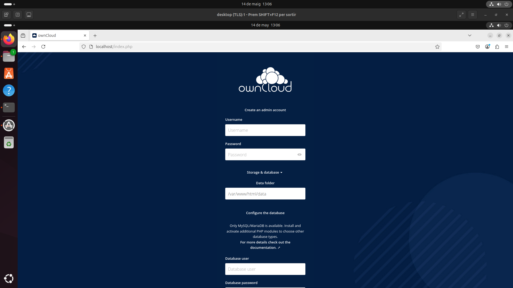
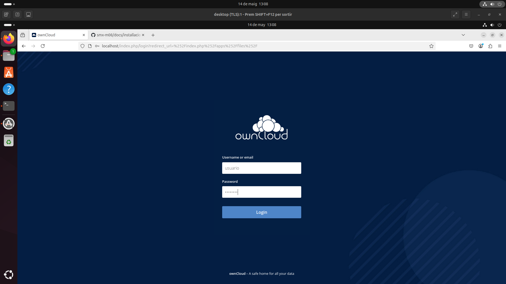

A continuación,la configuración detallada de ownCloud:

1. Acceso al navegador web y configuración de la nube.

.

http://localhost

1. Creación del usuario administrador y base de datos
Durante el proceso de instalación de ownCloud se deben ingresar los siguientes datos para crear el usuario administrador:

Usuario: usuario

Contraseña: password

Base de datos: bbdd

Dominio: localhost

Una vez completada esta configuración inicial, se mostrará la pantalla de inicio de sesión.

.

2. Inicio de sesión
Iniciar sesión en ownCloud utilizando el nombre de usuario y la contraseña configurados en el paso anterior.

Captura:
22.png

3. Acceso a la sección de usuarios
Una vez iniciada la sesión, acceder a la sección Users desde el menú lateral. Desde aquí se puede gestionar la creación de nuevos usuarios y administradores.

Captura:
23.png

4. Gestión de usuarios y carpetas
Dentro de Users se pueden realizar las siguientes acciones:

Crear nuevos usuarios y asignarles permisos.

Definir cuotas de almacenamiento (desde 1 GB hasta almacenamiento ilimitado).

Crear carpetas por usuario.

Captura:
24.png

5. Subida de archivos
A través del botón + es posible:

Subir documentos desde el equipo local.

Crear archivos de texto.

Crear carpetas.

Los archivos subidos se almacenan en la nube propia del servidor ownCloud.

Captura:
25.png

6. Preferencias del usuario
En el apartado de Preferencias se puede acceder a la configuración del perfil del usuario, donde se permite:

Modificar el nombre.

Configurar el correo electrónico (por ejemplo, una cuenta de Gmail).

Cambiar ajustes personales.

Captura:
26.png

7. Panel de administración
Desde el menú Admin, accesible únicamente por usuarios con permisos de administrador, se pueden realizar las siguientes acciones:

Instalar y desinstalar aplicaciones.

Personalizar distintos aspectos del servidor ownCloud.

Configurar opciones avanzadas de seguridad y rendimiento.

Captura:
27.png

8. Acceso al Market
El apartado Market permite ampliar las funcionalidades de ownCloud mediante la instalación de aplicaciones adicionales, como por ejemplo:

Calendario

Galería de imágenes

Notas

Gestión de tareas, entre otras

Captura:
28.png

9. Sección de actividad
La sección Actividad muestra un historial completo de todas las acciones realizadas en el servidor por el usuario actual. Incluye operaciones como:

Carga de archivos

Modificación de documentos

Creación de carpetas

Acciones compartidas

Captura:
29.png

