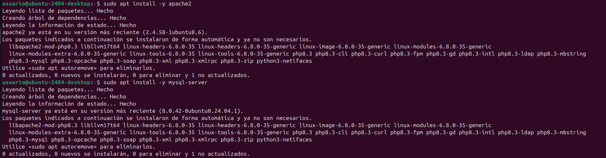
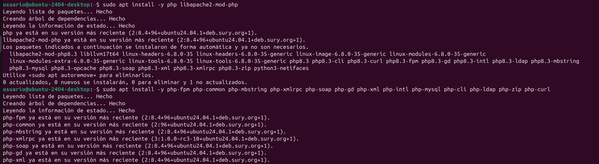
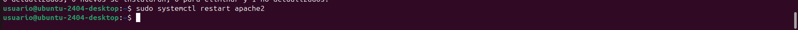
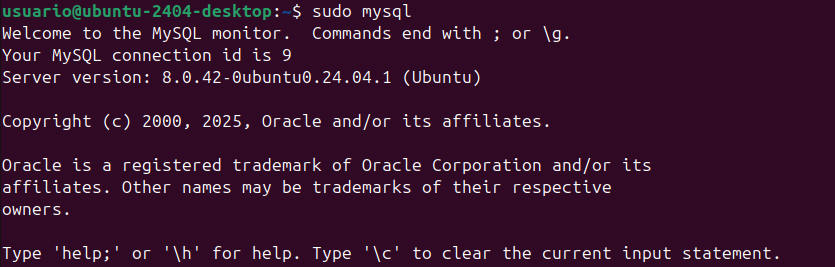
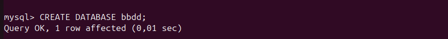
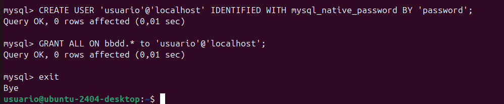
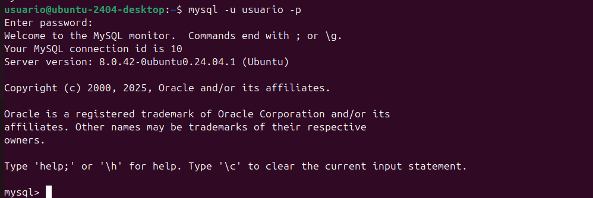

Manual de instalación de ownCloud Server en Ubuntu 24.04

Paso 1: Descargar el archivo .zip de ownCloud Server

Paso 2: Instalar la versión 7.4 de PHP

Actualizar las listas de paquetes y actualizar todos los paquetes existentes:

Instalar los requisitos previos de PPA:
Seleccionar la versión de PHP que se desea utilizar:

Agregar el repositorio de PHP 7.4:

Actualizar los repositorios:

Seleccionar la versión de PHP que se desea utilizar:
Reiniciar Apache2:

Paso 3: Instalar Apache2, MySQL y algunas bibliotecas

Actualizar la máquina:

Instalar el servidor web Apache2:

Instalar el servidor de bases de datos MySQL:

Instalar algunas bibliotecas de PHP:

Reiniciar el servidor Apache2:

Paso 4: Configurar MySQL

Acceder a la consola de MySQL:

.

Crear la base de datos:

Crear un usuario:

Dar permisos al usuario:

Salir de la base de datos:
.
.

Probar la conexión a la base de datos:
.

Paso 5: Descargar los archivos de la aplicación web

Descargar los archivos de la aplicación web:
sudo cp ~/Baixades/app-web.zip /var/www/html
Ir al directorio /var/www/html:
cd /var/www/html
Descomprimir el archivo:
sudo unzip app-web.zip

NO PONGO CAPTURA DE ESTOS PASOS PORQUE LE HE DADO SINQUERER Y EL UNZIP ME LO A LLENADO Y NO VEO LOS COMANDOS.

Copiar los archivos a la carpeta /var/www/html:

.

Eliminar la carpeta creada al descomprimir:
sudo rm -rf app-web/
Eliminar el archivo index.html de Apache2:
sudo rm -rf /var/www/html/index.html
Paso 6: Aplicar permisos a las aplicaciones web

Ir al directorio /var/www/html:
cd /var/www/html
Aplicar permisos:
sudo chmod -R 775 .
sudo chown -R usuario:www-data .
Paso 7: Acceder al navegador y configurar la nube

Acceder al navegador y configurar la nube:
http://localhost
Crear un usuario admin y configurar la base de datos:
usuari: usuario
contrasenya: password
base de dades: bbdd
domini: localhost
Fin

Si todo ha ido bien, se debería ver el instalador de la aplicación web que se ha descargado y te pedira crear un usuario admin y configurar la base de datos.
