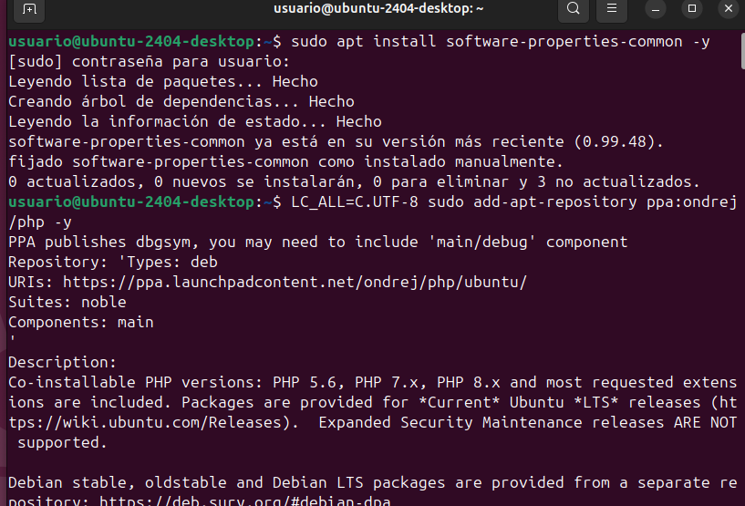
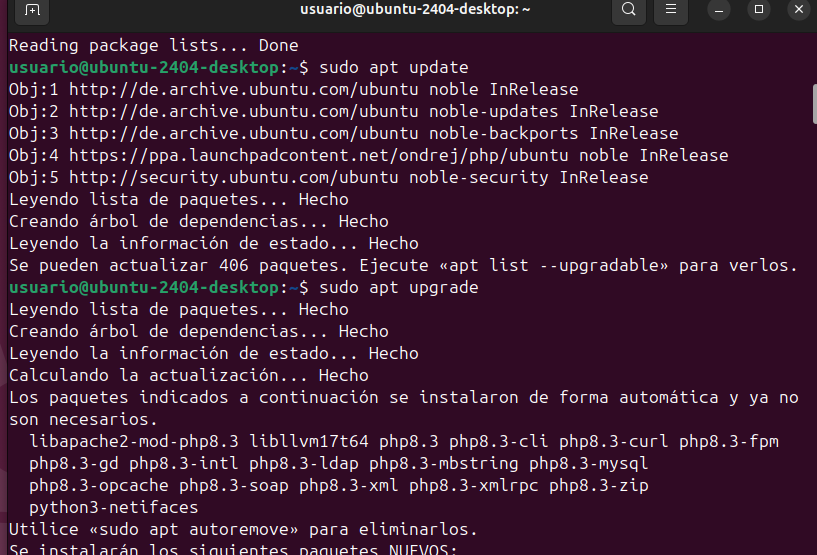
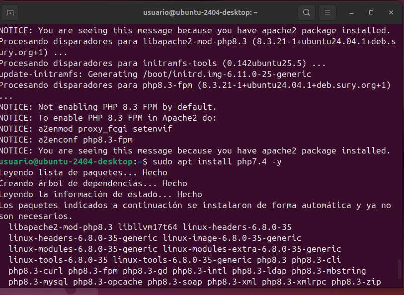
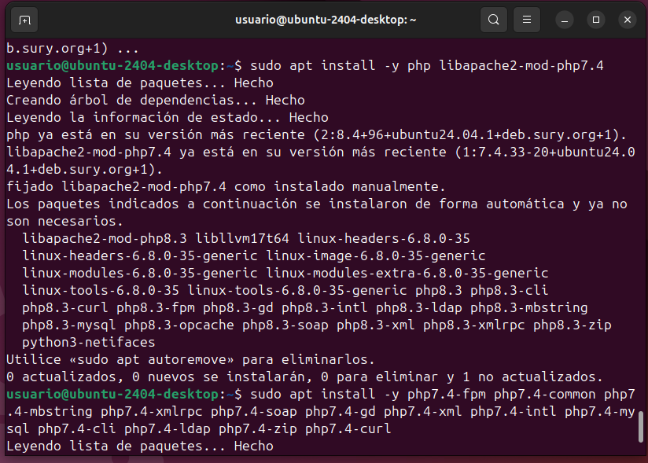
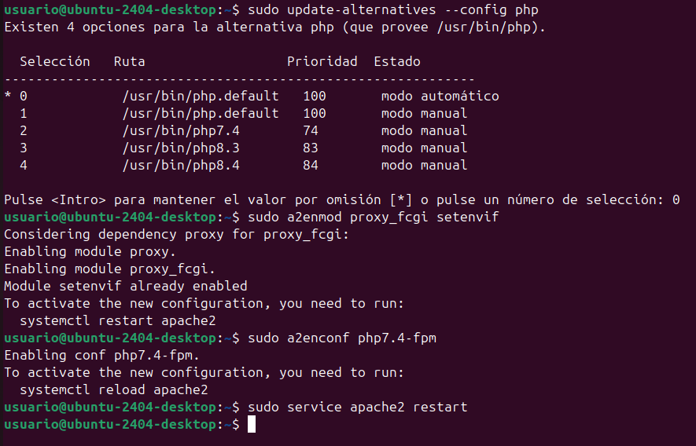
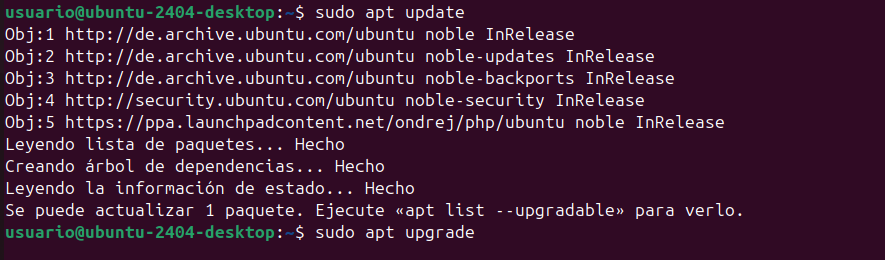

Manual de instalación de ownCloud Server en Ubuntu 24.04

Paso 1: Descargar el archivo .zip de ownCloud Server

Paso 2: Instalar la versión 7.4 de PHP

Actualizar las listas de paquetes y actualizar todos los paquetes existentes:

sudo apt update
Instalar los requisitos previos de PPA:
Seleccionar la versión de PHP que se desea utilizar:

sudo apt install software-properties-common -y
Agregar el repositorio de PHP 7.4:
LC_ALL=C.UTF-8 sudo add-apt-repository ppa:ondrej/php -y
Actualizar los repositorios:

Seleccionar la versión de PHP que se desea utilizar:
Reiniciar Apache2:

Paso 3: Instalar Apache2, MySQL y algunas bibliotecas

Actualizar la máquina:

sudo apt update
sudo apt upgrade
Instalar el servidor web Apache2:
sudo apt install -y apache2
Instalar el servidor de bases de datos MySQL:
sudo apt install -y mysql-server
Instalar algunas bibliotecas de PHP:
sudo apt install -y php libapache2-mod-php
sudo apt install -y php-fpm php-common php-mbstring php-xmlrpc php-soap php-gd php-xml php-intl php-mysql php-cli php-ldap php-zip php-curl
Reiniciar el servidor Apache2:
sudo systemctl restart apache2
Paso 4: Configurar MySQL

Acceder a la consola de MySQL:
sudo mysql
Crear la base de datos:
CREATE DATABASE bbdd;
Crear un usuario:
CREATE USER 'usuario'@'localhost' IDENTIFIED WITH mysql_native_password BY 'password';
Dar permisos al usuario:
GRANT ALL ON bbdd.* to 'usuario'@'localhost';
Salir de la base de datos:
exit
Probar la conexión a la base de datos:
mysql -u usuario -p
Paso 5: Descargar los archivos de la aplicación web

Descargar los archivos de la aplicación web:
sudo cp ~/Baixades/app-web.zip /var/www/html
Ir al directorio /var/www/html:
cd /var/www/html
Descomprimir el archivo:
sudo unzip app-web.zip
Copiar los archivos a la carpeta /var/www/html:
sudo cp -R app-web/. /var/www/html
Eliminar la carpeta creada al descomprimir:
sudo rm -rf app-web/
Eliminar el archivo index.html de Apache2:
sudo rm -rf /var/www/html/index.html
Paso 6: Aplicar permisos a las aplicaciones web

Ir al directorio /var/www/html:
cd /var/www/html
Aplicar permisos:
sudo chmod -R 775 .
sudo chown -R usuario:www-data .
Paso 7: Acceder al navegador y configurar la nube

Acceder al navegador y configurar la nube:
http://localhost
Crear un usuario admin y configurar la base de datos:
usuari: usuario
contrasenya: password
base de dades: bbdd
domini: localhost
Fin

Si todo ha ido bien, se debería ver el instalador de la aplicación web que se ha descargado y te pedira crear un usuario admin y configurar la base de datos.
